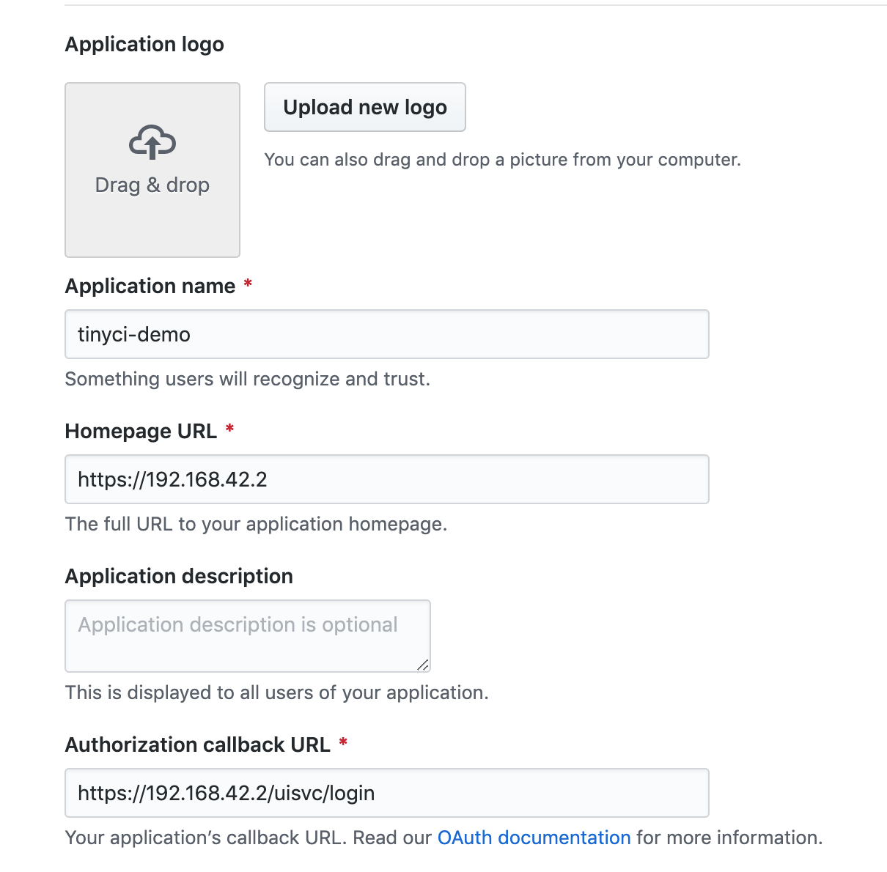

# tinyCI demo repository

This repository contains the vagrant demo for tinyCI. It, by default, runs one
instance of the tinyCI VM for UI and other services, and another for a docker
runner (overlay-runner). You can customize it to run multiple runners.

This demo only works on Linux and OS X. Be sure to [check out the docs before getting started.](https://tinyci.org)

Before anything, you need the following tools installed and operational:

* [VirtualBox](https://virtualbox.org)
* [Vagrant](https://vagrantup.com)
* Ansible
  * OS X: `brew install ansible` (via [homebrew](https://brew.sh))
  * Ubuntu: `apt-get install ansible`

Additionally, [mkcert](https://github.com/FiloSottile/mkcert) will be downloaded using the system's `curl` tool.

Firstly, setup an [oauth account](https://github.com/settings/developers). Make it look like this:

* Clone this repository.
* Get a [copy of the release](https://github.com/tinyci/tinyci/releases/) and
  name it `release.tar.gz`, and put it at the root of this repository's clone.
* Create a `customize.rb` from the sample file. Be sure to include the client
  values from the oauth creation step above!
* Run `make setup`.
* Assuming `make setup` succeeds, run `make start`.

Your UI will be @ https://192.168.42.2. Be sure to accept the cert!

If you want a really quick start and want to see the jobs run:

* Click "Add to CI".
* Click the "people" icon to upgrade your oauth token to one that can run CI jobs. This will refresh the page after success.
* Then, click the "cloud" icon to scan your repositories.
* Fork [tinyci/ci-ui](https://github.com/tinyci/ci-ui) (a few small jobs) or [tinyci/ci-agents](https://github.com/tinyci/ci-agents) (lots of jobs).
* After that, you can search for your fork and click the `+` symbol to move forward with adding your hook and allowing submissions.
* Then, "Submit" the repository's master branch using the UI element at the top
  of the web page.
